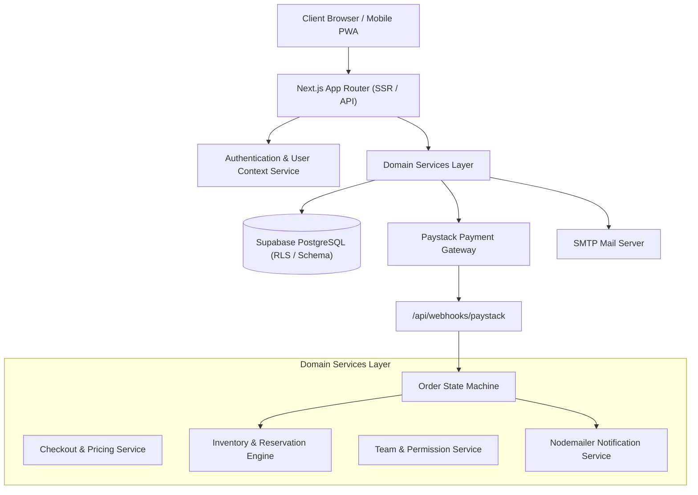
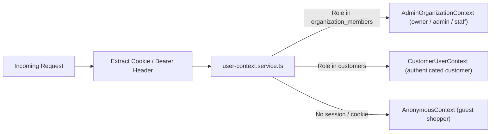
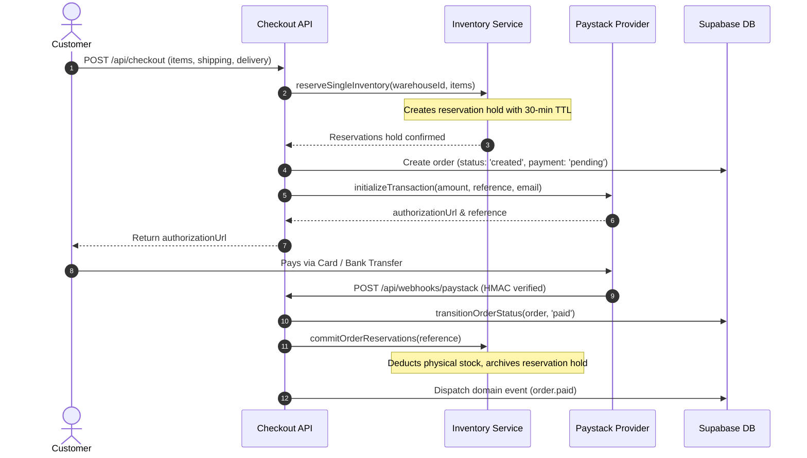

# System Architecture & Technical Specification

This document provides a technical deep-dive into the architectural patterns, security models, data flows, and transactional workflows of the **Unwind & Doodle** application.

---

## 🏗️ High-Level System Architecture

---

## 🔐 Authentication & Access Control (RBAC)

The application implements a strict two-tier authentication architecture separating **Storefront Customers** from **Backoffice Merchant Team Members**:

### Roles & Permissions Matrix

| Resource / Action | Guest | Customer | Staff | Admin | Owner |
| :--- | :---: | :---: | :---: | :---: | :---: |
| Browse Catalog & Products | ✅ | ✅ | ✅ | ✅ | ✅ |
| Add to Cart & Process Checkout | ✅ | ✅ | ❌ | ❌ | ❌ |
| View Customer Account & Orders | ❌ | ✅ (Own) | ❌ | ❌ | ❌ |
| View Admin Dashboard & Analytics | ❌ | ❌ | ✅ | ✅ | ✅ |
| Manage Products & Stock Receipts (GRN) | ❌ | ❌ | ✅ | ✅ | ✅ |
| Create Manual Orders & Payment Links | ❌ | ❌ | ✅ | ✅ | ✅ |
| Invite Team Members & Assign Roles | ❌ | ❌ | ❌ | ✅ | ✅ |
| Delete Team Members / Transfer Ownership | ❌ | ❌ | ❌ | ❌ | ✅ |

---

## 💳 Commerce Transaction Pipeline

To prevent overselling and race conditions during high-traffic drops, Unwind & Doodle uses a **Two-Phase Reservation & Commit** model:

---

## 📦 Multi-Warehouse Inventory & Fulfillment

- **Physical Inventory**: Tracked at specific physical hubs (e.g. Lagos Mainland Hub) with `quantity` and `reserved_quantity`.
- **Virtual Bundles**: Bundles do not have standalone stock rows. Instead, their buildable quantity is dynamically calculated from physical component availability via SQL RPC (`compute_buildable_bundles`).
- **Abandoned Hold Reclaim**: Expired reservations older than 30 minutes are automatically freed by `expireOldReservations()` or background revalidation tasks.

---

## 📬 Transactional Domain Events & Outbox

All key state changes emit structured domain events to the `domain_events` table within the active database transaction:
- `order.created`
- `order.paid`
- `order.status_changed`
- `order.cancelled`
- `customization.asset_processed`
- `stock_notification.eligible`

Background workers process pending outbox events asynchronously, guaranteeing that external services (email notifications, fulfillment triggers) never block user-facing HTTP request cycles.
